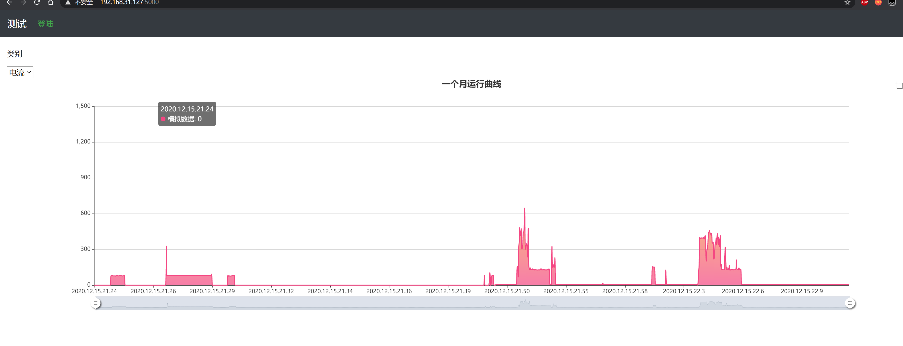

# esp32 INA219 current measure with python flask server

平台: esp32 + vscode + platformio + arduino + ina219

服务器: python3 flask + mysql

传输协议: http post

功能:  能采集ina219的电流和功率数据, 传输到flask服务器, 并且图像显示出来

效果:

